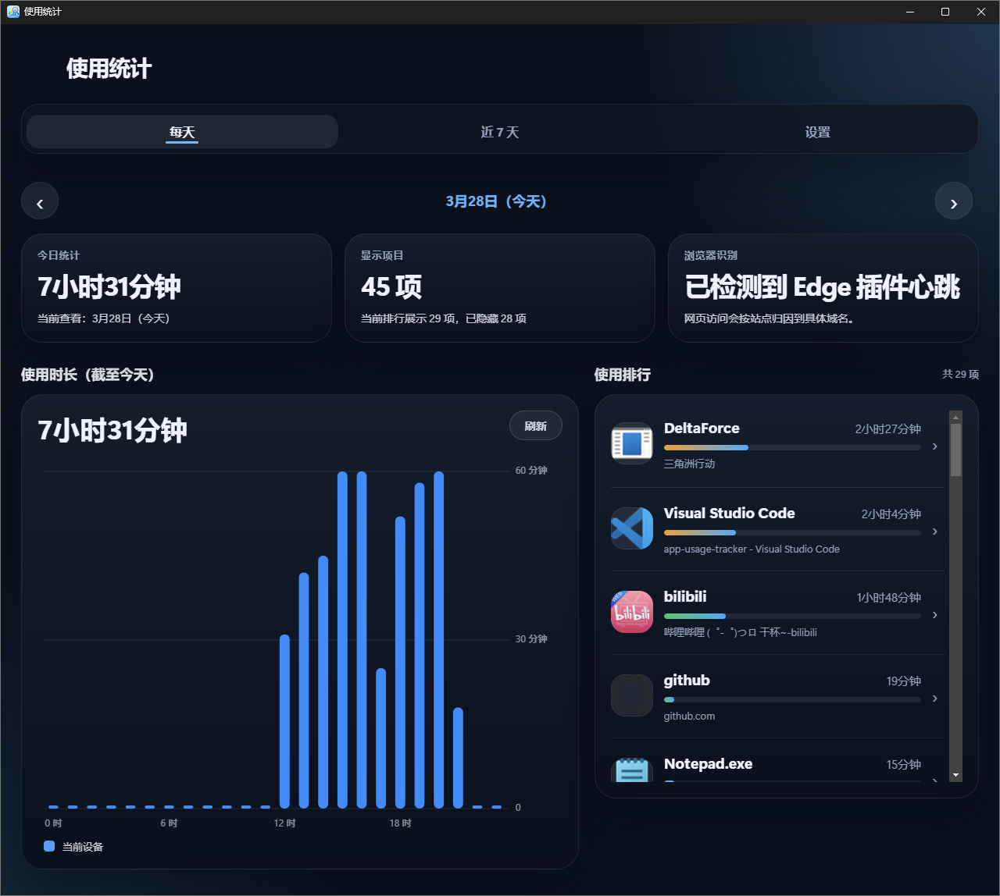
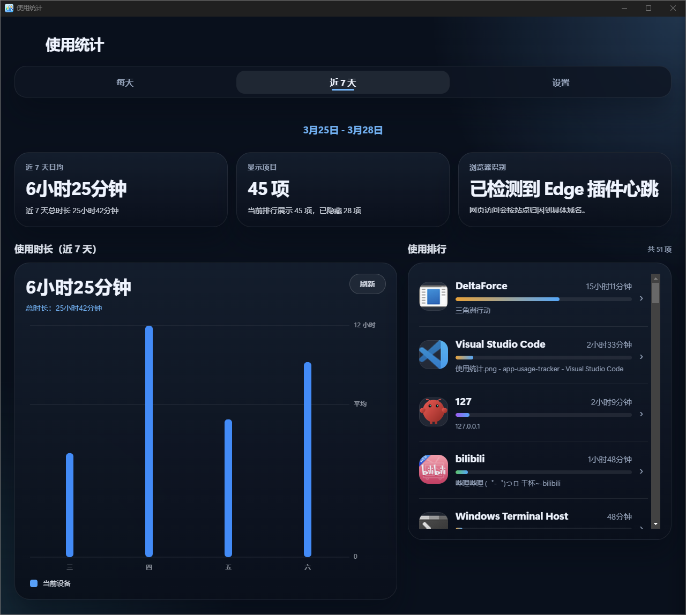
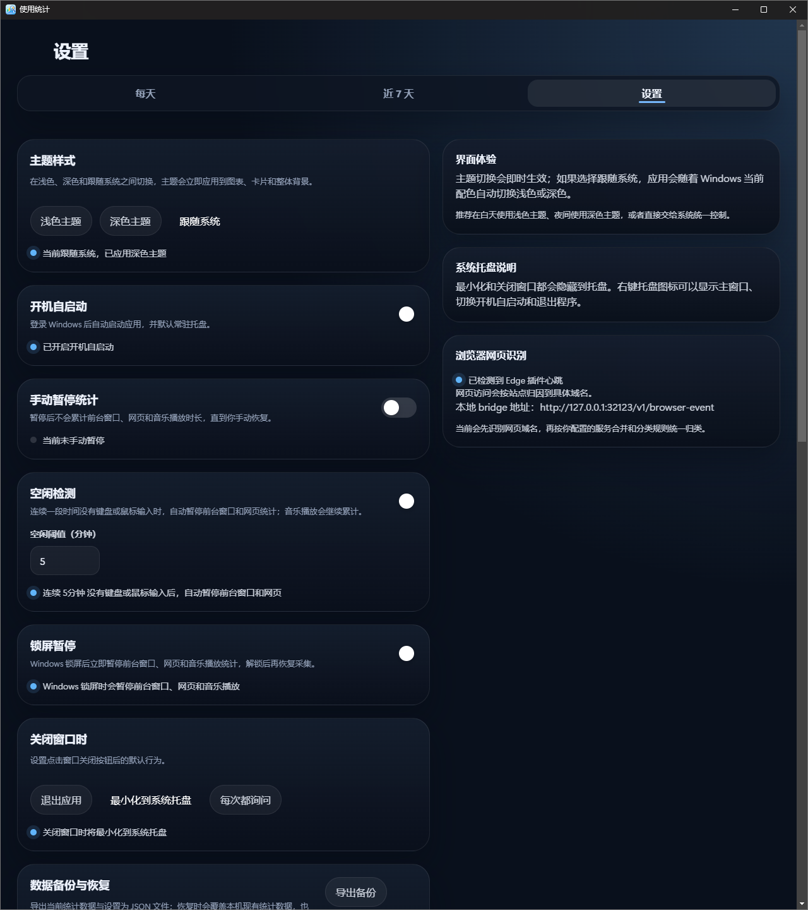

<p align="center">
  
</p>

<h1 align="center">App Usage Tracker</h1>

<p align="center">
  <strong>Local Windows usage tracking for apps, websites, and real music playback.</strong>
</p>

<p align="center">
  <a href="https://github.com/RACErace/app-usage-tracker/releases/latest">
    
  </a>
  
  
  
</p>

<p align="center">
  <a href="./README.zh-CN.md">简体中文</a>
</p>

---

App Usage Tracker records which desktop app is active, which website is open in the browser, and whether a supported music player is actually playing. It turns those raw signals into daily rankings, 7-day trends, real session timelines, detail views, local backups, and a CLI you can query from scripts or AI tools.

- Attribute browser time to sites instead of only browser apps
- Count actual music playback even when the player stays in the background
- Merge desktop apps and domains into a single service when that better reflects how you work
- Review the same dataset from the desktop UI, the CLI, and bundled AI skill files
- Keep usage data and settings in local JSON files

> The bundled browser extension only posts active-tab metadata to the local bridge at `http://127.0.0.1:32123`. No cloud account is required.

---

## What It Is

It is not a screenshot recorder or a surveillance dashboard. App Usage Tracker is a lightweight personal usage ledger for reviewing how time was actually spent on Windows.

- Foreground app tracking with window-aware labeling
- Website attribution through a companion browser extension
- Hybrid SMTC + WASAPI detection for real music playback
- Local automation via CLI queries and AI skill files
- Backup, restore, and visibility controls for long-term use

---

## Core Capabilities

### Tracking

| Capability | What it does |
|-----------|---------------|
| Foreground app tracking | Detects the current active window and records usage per desktop app |
| Website attribution | Attaches tab title, URL, domain, and route data to browser time when the extension is connected |
| Host-level site grouping | Tracks browsing records by full host by default so subdomains stay separate until you merge them |
| Page drill-down | Preserves page-level buckets for detail views on tracked websites |
| Music playback tracking | Combines Windows SMTC and WASAPI audio sessions to count actual playback time |

### Review and Automation

| Capability | What it does |
|-----------|---------------|
| Daily view | Shows totals, rankings, browser-recognition status, and hourly distribution for one day |
| 7-day trends | Aggregates the last seven days and highlights weekly totals plus daily averages |
| Timeline view | Replays one day's stored sessions with real start/end times, overlap lanes, and clickable detail entry points |
| Item detail view | Displays today's hourly breakdown, recent-day history, metadata, and page breakdown where available |
| Local CLI | Queries days, top items, timelines, searches, details, and full snapshots from local data |
| AI skill files | Ships ready-to-use skills for Codex, OpenClaw, or similar assistants |

### Control and Reliability

| Capability | What it does |
|-----------|---------------|
| Custom service rules | Merges desktop apps and website domains into one logical service |
| Category rules | Tags items as Work, Entertainment, Study, or Communication |
| Visibility controls | Hides selected items from totals, rankings, timelines, searches, and snapshots |
| Tracking protection | Supports manual pause, idle pause, and lock-screen pause |
| Desktop behavior | Supports tray mode, auto-launch, close behavior, and light/dark/system themes |
| Backup and recovery | Exports/imports JSON backups and can generate automatic local backups |

---

## Interface Preview

### Daily Overview



Daily mode is built for “what did today look like?”: total usage, visible-item count, browser extension status, ranking, and drill-down entry points all stay on one screen.

### Last 7 Days



Weekly mode rolls the last seven days into one view so it is easier to spot recurring tools, dominant websites, and overall usage rhythm.

### Settings



Settings centralize tray behavior, startup, pause rules, service/category rules, backup flow, item visibility, theme preference, and browser-extension status.

---

## How Tracking Works

Windows can reliably tell the app which window is in the foreground, but website-level attribution needs browser help. The project therefore uses a desktop app plus local extension bridge:

1. The desktop app polls the current foreground window.
2. The browser extension sends active-tab title and URL metadata to a localhost bridge.
3. Music tracking reads Windows SMTC media sessions and WASAPI audio sessions.
4. The tracker merges those signals into app, site, or merged-service entries.
5. The UI and CLI both read from the same local dataset.

Notes:

- Without the extension, browser usage is still tracked, but only at the browser-app level.
- Music playback can overlap with another foreground app, so a music item's total can differ from pure foreground-window time.
- Players that expose neither usable SMTC metadata nor an active WASAPI session fall back to regular foreground tracking.

---

## Screens

| Screen | Purpose |
|-------|---------|
| Daily | Daily charts, rankings, current totals, and browser-extension status |
| Last 7 Days | Weekly aggregation of recent totals, rankings, and daily rhythm |
| Timeline | Session-by-session day replay with real start/end times and overlapping playback or foreground blocks |
| Detail | Hourly breakdown, recent-day history, metadata, and page breakdown for tracked sites |
| Settings | Startup, tray behavior, pause rules, backup, visibility, theme, service rules, and category rules |

---

## Requirements

- Windows
- Node.js 20+
- npm
- Visual Studio 2022 Build Tools with `Desktop development with C++` if you want to build Windows packages locally

---

## Installation

Download the latest build from [Releases](https://github.com/RACErace/app-usage-tracker/releases/latest).

| Package | Format |
|--------|--------|
| Installer | `.exe` (NSIS) |
| Portable | `.exe` |

### Quick Start From Source

```powershell
npm install
npm start
npm run start:dev
```

- `npm start` launches the detached packaged-style app
- `npm run start:dev` keeps Electron in the foreground for debugging

---

## Browser Extension

The Chromium-compatible extension lives in [`browser-extension`](./browser-extension).

To load it in Chrome, Edge, Brave, or Opera:

1. Open the browser extensions page
2. Enable developer mode
3. Choose `Load unpacked`
4. Select the `browser-extension` directory from this repository

The extension posts active-tab metadata to:

```text
http://127.0.0.1:32123/v1/browser-event
```

If the desktop app stops receiving extension heartbeats, the UI shows that the browser extension is currently not connected.

Firefox support is limited; the bundled extension is implemented primarily for Chromium-style extension APIs.

---

## CLI

The local CLI lives at `src/cli/query.js`.

From the repository:

```powershell
npm run query -- days --format json
npm run query -- top --range day --day latest --limit 10 --format json
npm run query -- timeline --day latest --limit 20 --format json
npm run query -- search --query "ChatGPT" --format json
npm run query -- detail --key service:chatgpt --format json
npm run query -- snapshot --format json
```

From an installed Windows build:

```powershell
app-usage-tracker-cli days --format json
```

Notes:

- The installer adds the app install directory to the current user's `PATH`
- Reopen PowerShell, Command Prompt, or Windows Terminal if the shell was already open before installation
- The installed wrapper is available at `%LOCALAPPDATA%\Programs\app-usage-tracker\app-usage-tracker-cli.cmd`
- The CLI respects visibility settings from `settings.json`, so hidden items are excluded from totals, rankings, timelines, searches, and snapshots
- `timeline` returns real stored sessions when available; older days collected before the session-detail upgrade may only expose aggregated totals
- Prefer `--format json` for scripts, agents, and automation

Supported data-location overrides:

- `--data-file <path>`
- `APP_USAGE_TRACKER_DATA_FILE`
- `--user-data-dir <dir>`
- `APP_USAGE_TRACKER_USER_DATA_DIR`

---

## AI Skill Files

The repository includes AI skill files in [`skills/app-usage-tracker-query`](./skills/app-usage-tracker-query) so assistants can query local usage data and timelines through the CLI.

The GitHub Release workflow also publishes a `skills.zip` asset alongside Windows packages.

---

## Data Locations

By default the app stores data under `%APPDATA%\app-usage-tracker\`:

- `usage-data.json`: usage records
- `settings.json`: app settings and rule configuration
- `backups\`: automatic backup directory
- `icon-cache\`: cached icons

---

## Tech Stack

| Layer | Technology |
|------|------|
| Desktop framework | Electron 35 |
| Main process / backend | Node.js |
| Frontend | Vanilla HTML + CSS + JavaScript |
| CLI | Node.js |
| Storage | Local JSON |
| Packaging | electron-builder |

---

## Development

```powershell
npm install
npm run start:dev
npm test
npm run pack
npm run dist
```

Useful package commands:

```powershell
npm run dist:portable
npm run dist:installer
```

Project layout:

| Path | Purpose |
|------|---------|
| `src/main` | Electron main process, tracking, storage, bridge, icons, and backup logic |
| `src/renderer` | Desktop UI |
| `src/cli` | Local query CLI |
| `browser-extension` | Browser bridge extension |
| `skills` | AI skill files |
| `scripts` | Helper scripts |
| `test` | Automated tests |

The repository includes a Windows build workflow at [`.github/workflows/build-windows.yml`](./.github/workflows/build-windows.yml). Pushes to `main` build Windows artifacts, and tags matching `v*` also create a GitHub Release that uploads installer, portable, browser-extension, and skill bundles.

---

## Limitations

- The project currently focuses on Windows
- Browser site attribution is best with the bundled extension; without it, browser time falls back to the browser app itself
- Service merging and categorization depend on the rules you configure
- Some favicon or raw asset URLs may occasionally appear as recent web entries
- Browser-based web players are not tracked as standalone music apps

---

## License

This repository is licensed under the [MIT License](./LICENSE).
